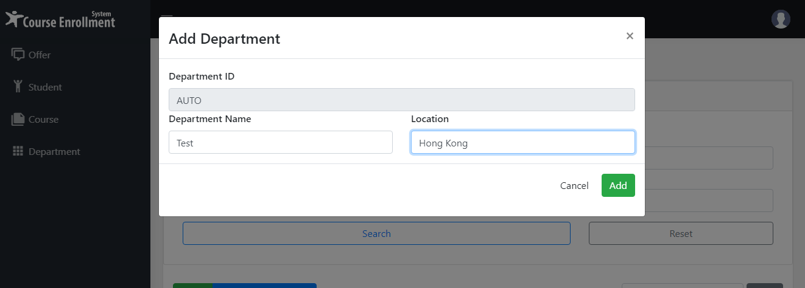
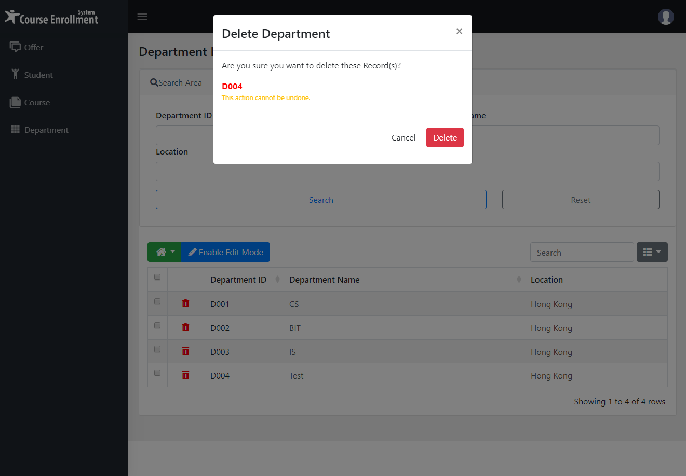
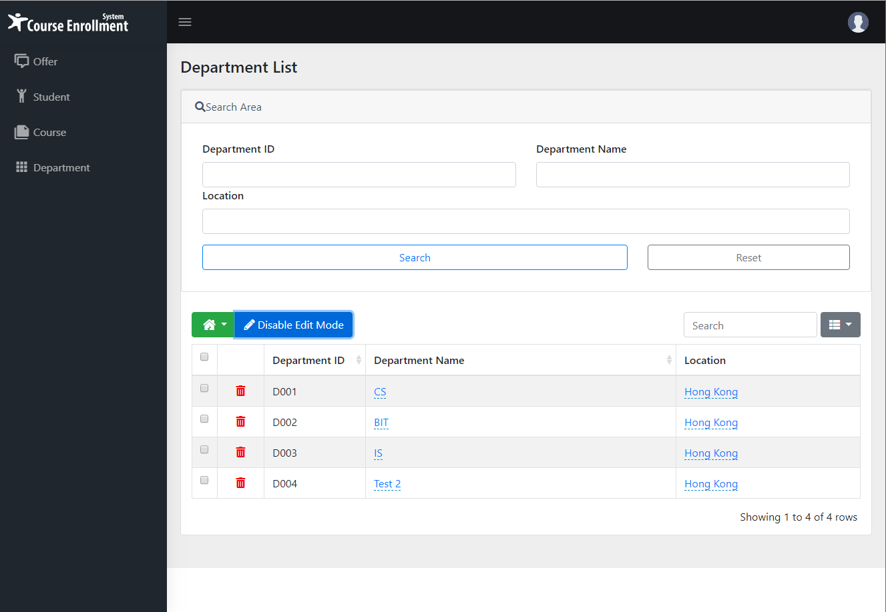
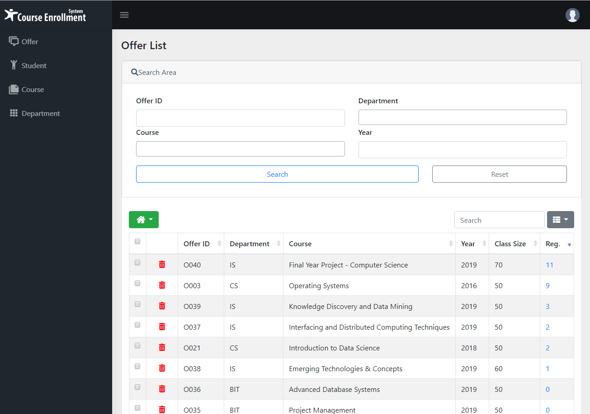
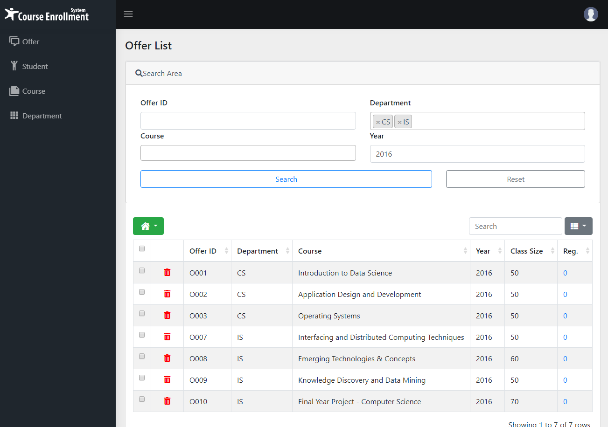
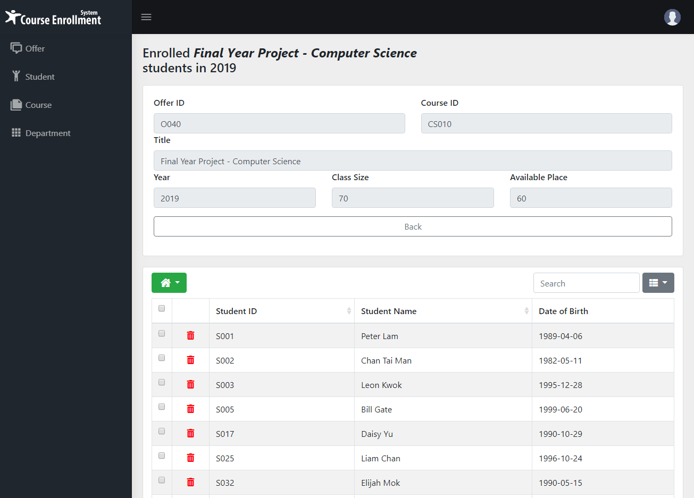
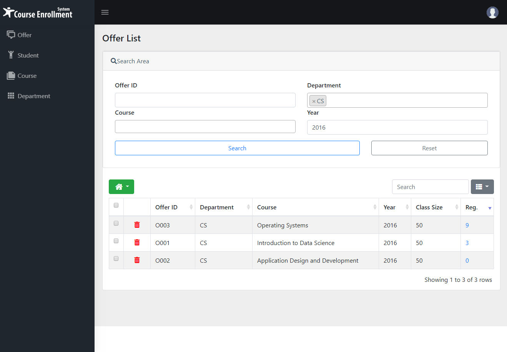
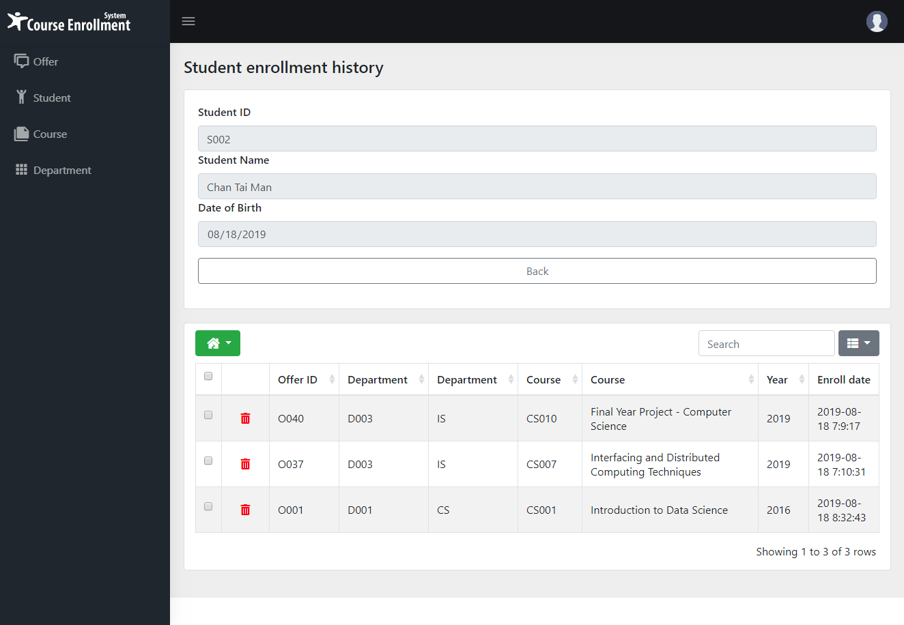
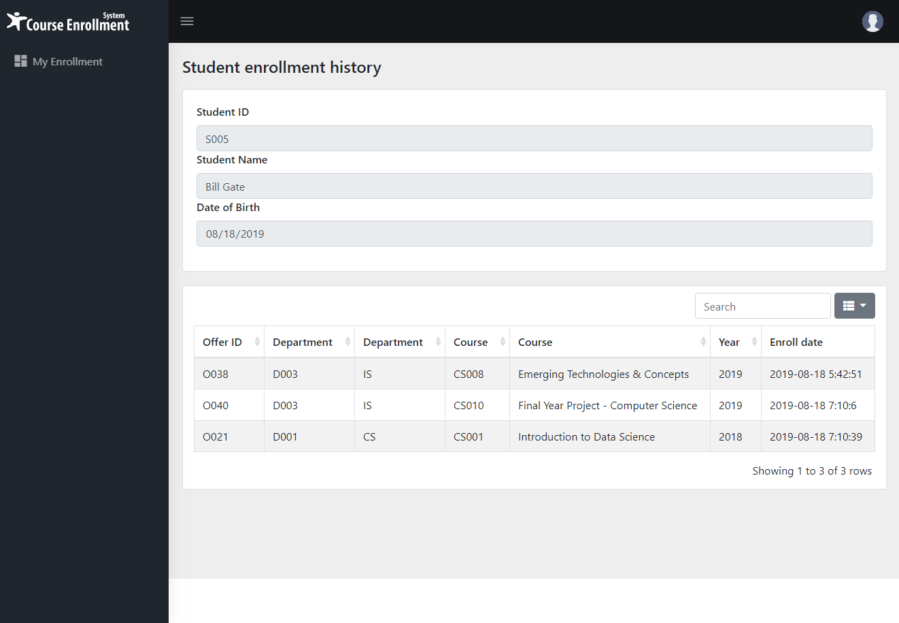

# Course Enroll System
*Course Enroll System* (this system) is a CRUD course enrollment system. This system aims to deploy to education organization which provide easy user interface for students to view their enrolled course. For the administator operation, this system can help manage courses hold in school. And allow administrator to view the course enrollment summary. 

## Technical used

1. PHP
    - Backend processing such as get data from database

1. HTML, CSS
    - Used to handle user interface, such as web page style

1. JQuery
    - Handling user' interaction with the system. For example: button on click event. 

1. MongoDB
    - Used to data storage for studend, course and enrollment data

## Main Functions screens
Create new course  

Delete Course 

Modify Course (inline) 

Delete Course 

Searching 

Show enrolled student list by course 

Show enrolled summary by course 

Show enrolled summary student by student 

Show enrolled by student 
